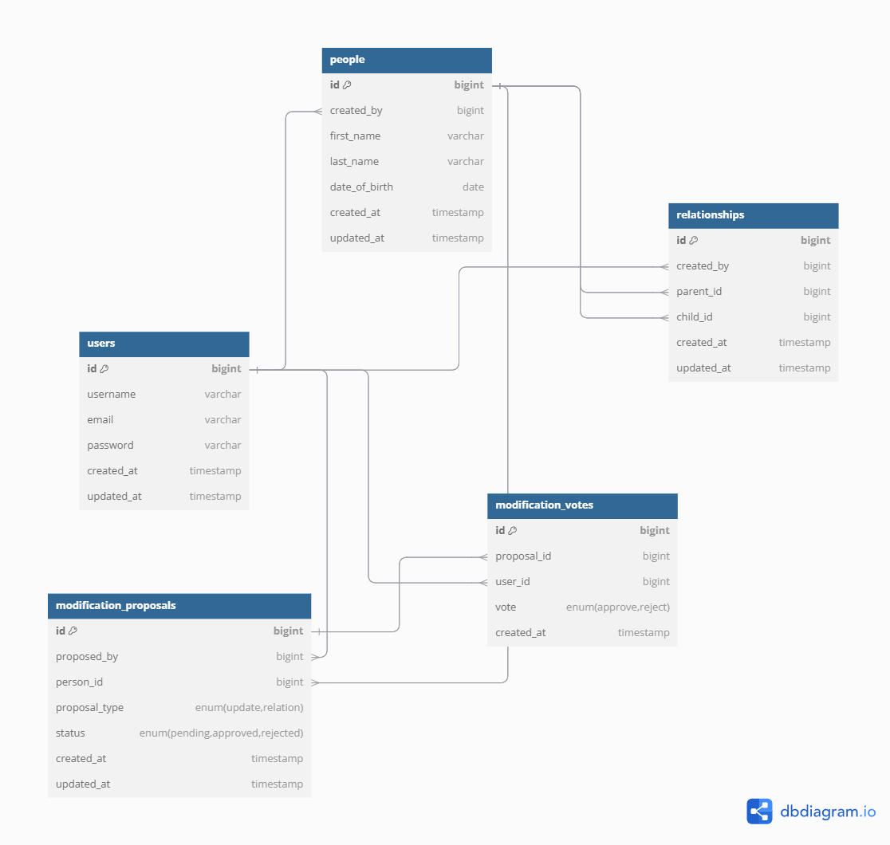

#### 1. **Création d'une proposition de modification**
Lorsqu'un utilisateur souhaite proposer une modification (par exemple, l'ajout d'une relation entre deux personnes ou la modification des informations d'une personne), une entrée est ajoutée dans la table `modification_proposals`. Voici les étapes :

1. **L'utilisateur soumet une proposition de modification :**
   - Un utilisateur propose soit de modifier une fiche d'une personne (par exemple, modifier le nom ou la date de naissance), soit de créer une relation entre deux personnes (comme "parent-enfant").
   - Une entrée est alors ajoutée dans la table `modification_proposals` avec les champs suivants :
     - `proposed_by` : L'ID de l'utilisateur qui propose la modification.
     - `person_id` : L'ID de la fiche de la personne concernée par la modification.
     - `proposal_type` : Le type de la proposition (soit `'update'` pour une modification d'information, soit `'relation'` pour une relation familiale).
     - `status` : Le statut de la proposition, qui est initialement défini à `'pending'` (en attente de validation).

   **Exemple :**
   - L'utilisateur `rose03` propose d'ajouter une relation de parenté entre elle-même et son père `jean01`.
   - La table `modification_proposals` contiendra une entrée avec `proposed_by = rose03`, `person_id = 5` (la personne `rose03`), `proposal_type = 'relation'`, et `status = 'pending'`.

#### 2. **Les votes sur la proposition de modification**
Une fois la proposition soumise, les autres utilisateurs peuvent voter pour approuver ou rejeter la modification. Les votes sont enregistrés dans la table `modification_votes`.

1. **Les utilisateurs votent sur la proposition :**
   - Chaque utilisateur peut voter en faveur de la proposition (`'approve'`) ou contre celle-ci (`'reject'`).
   - Une ligne est ajoutée dans la table `modification_votes` pour chaque vote. Cette ligne contient :
     - `proposal_id` : L'ID de la proposition de modification.
     - `user_id` : L'ID de l'utilisateur qui vote.
     - `vote` : Le vote de l'utilisateur (`'approve'` ou `'reject'`).

   **Exemple :**
   - L'utilisateur `jean01` vote pour approuver la relation proposée.
   - La table `modification_votes` contient une ligne avec `proposal_id = 1`, `user_id = jean01`, et `vote = 'approve'`.

#### 3. **Validation de la proposition**
Une fois que des votes ont été exprimés, la proposition de modification passe par une phase de validation en fonction du nombre de votes :

1. **La proposition est validée par 3 utilisateurs :**
   - Si 3 utilisateurs approuvent la proposition, elle est validée.
   - Le statut de la proposition dans la table `modification_proposals` est mis à jour de `'pending'` à `'approved'`.

   **Exemple :**
   - Si trois utilisateurs, par exemple `jean01`, `marie02`, et `lucas05`, ont voté pour approuver la proposition, le statut de la proposition dans la table `modification_proposals` passe à `'approved'`.

2. **La proposition est rejetée par 3 utilisateurs :**
   - Si 3 utilisateurs rejettent la proposition, elle est annulée et n'est pas validée.
   - Le statut de la proposition est mis à jour de `'pending'` à `'rejected'`.

   **Exemple :**
   - Si trois utilisateurs, par exemple `paul20`, `marie02`, et `lucas05`, ont voté pour rejeter la proposition, le statut de la proposition dans la table `modification_proposals` passe à `'rejected'`.

#### 4. **Mise à jour de la base de données après validation**
Une fois la proposition validée, l'action de modification est effectivement appliquée :

1. **Modification des informations :**
   - Si la proposition concernait une modification des informations d'une personne (par exemple, son prénom ou sa date de naissance), ces informations sont mises à jour dans la table `people`.

2. **Ajout d'une relation familiale validée :**
   - Si la proposition concernait une relation (par exemple, une relation parent-enfant), une nouvelle entrée est ajoutée dans la table `relationships`, avec les `parent_id` et `child_id` correspondants.

   **Exemple :**
   - Si la proposition a été validée pour ajouter une relation entre `rose03` (person_id = 5) et `jean01` (person_id = 2), une entrée est insérée dans la table `relationships` avec `parent_id = 2` et `child_id = 5`.

---

### Schéma de la Base de Données

Voici le schéma de la base de données qui illustre la structure des tables impliquées dans le processus de gestion des propositions et de validation des modifications :

---